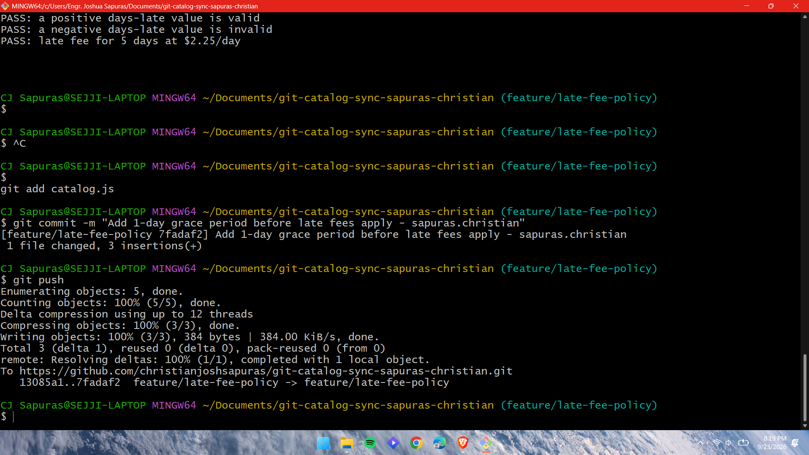
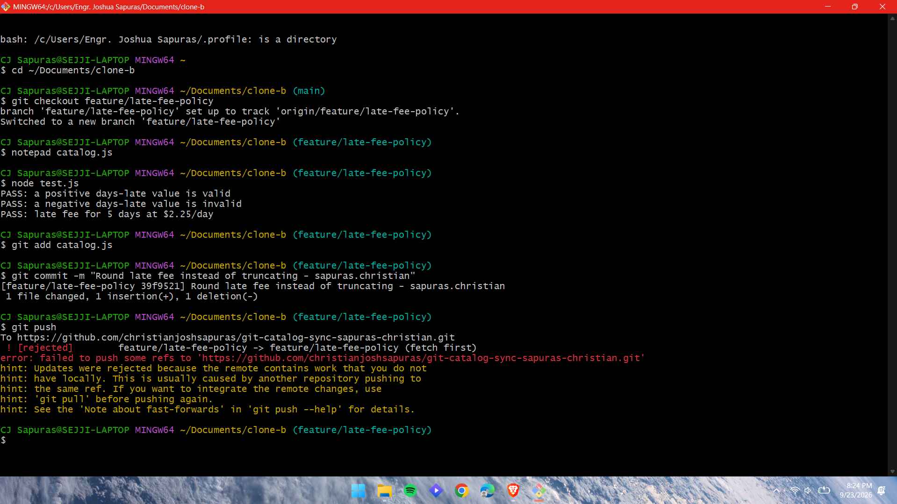
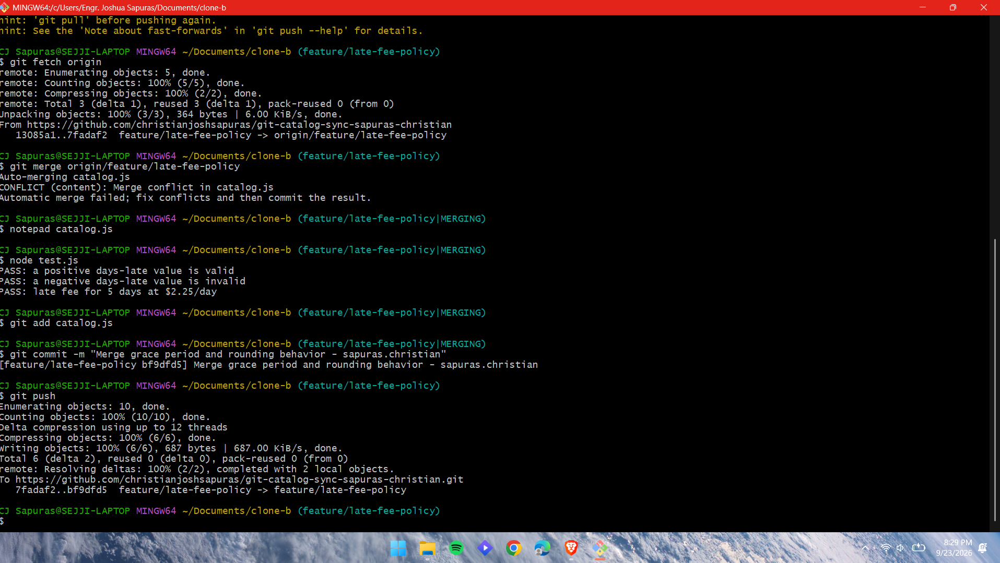
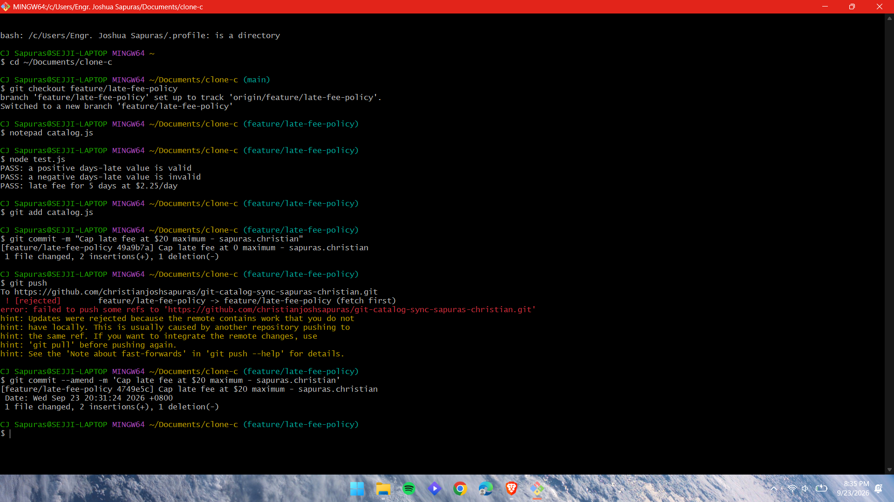
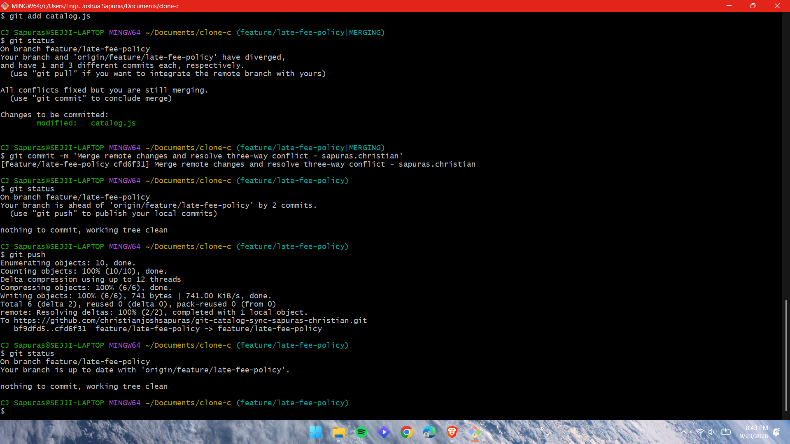
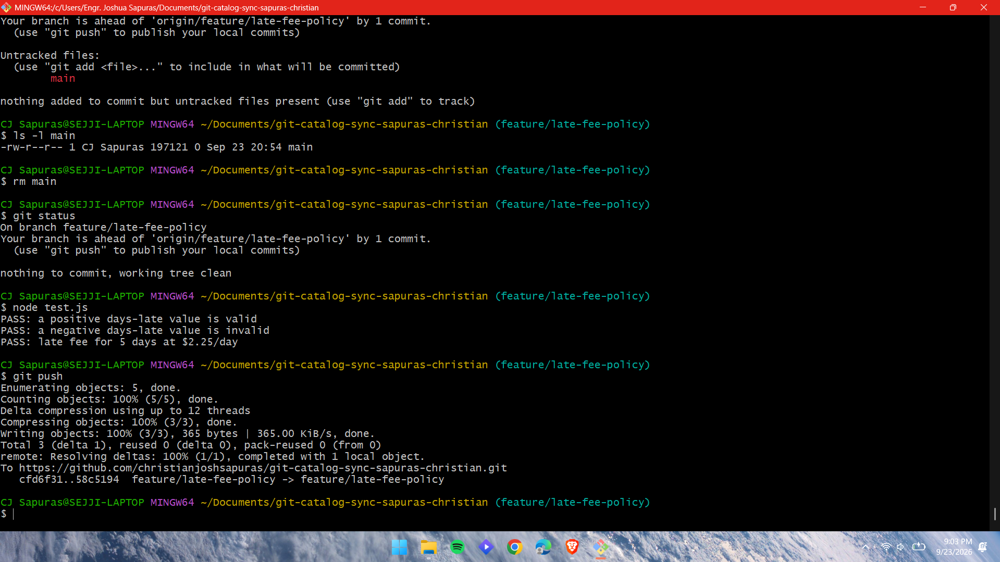
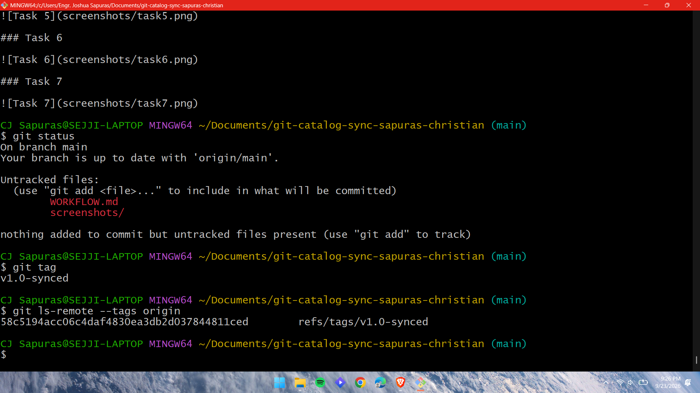

# Git Catalog Sync Workflow

## 1. Final calculateLateFee walkthrough

The final calculateLateFee combines the changes made during the different tasks:

```js
function calculateLateFee(daysLate, ratePerDay) {
  if (daysLate <= 1) {
    return 0;
  }

  const fee = Math.round(daysLate * ratePerDay);
  return Math.max(1, Math.min(fee, 20));
}
```

- 1-day grace period: Clone A added the daysLate <= 1 check, making the fee $0 for one day late or less.
- Rounding: Clone B changed the calculation from Math.floor() to Math.round().
- $20 maximum: Clone C added Math.min(fee, 20) to cap the fee at $20.
- $1 minimum: Clone A later added Math.max(1, ...) during Task 6.
- The final version combines all four behaviors. The grace-period check comes first, so a borrower within the grace period still pays $0.

## 2. Task 3 two-way conflict vs. Task 5 three-way conflict

The Task 3 conflict was a two-way conflict between Clone B's changes and the changes already pushed by Clone A. Clone A had added the grace period, while Clone B had changed the calculation to use rounding. The conflict was resolved by keeping both changes.

The Task 5 conflict was more complicated because Clone C had added the $20 maximum fee cap while the remote branch already contained the grace-period and rounding changes. The resolution had to combine the existing changes with the new maximum-fee behavior. The final result kept the grace period, rounding, and $20 cap.

## 3. Task 5 merge vs. Task 6 rebase

In Task 5, Clone C used a merge after fetching the remote changes. The different histories were combined, and a merge commit was created.

In Task 6, Clone A used a rebase instead of a merge. The local $1 minimum-fee commit was replayed on top of the latest remote commit. Because the commit was replayed, it received a new commit ID. The rebase resulted in a linear history without creating another merge commit.

## 4. Process change that could prevent the rejected pushes

One process change would be to synchronize with the remote branch before starting work from an older clone. Each clone could fetch the latest remote changes before making and pushing changes, then merge or rebase the latest changes before pushing. This would reduce the chance of pushing a branch that is behind the remote branch and receiving a "fetch first" rejection.

## Screenshots

### Task 1



### Task 2



### Task 3



### Task 4



### Task 5



### Task 6



### Task 7


